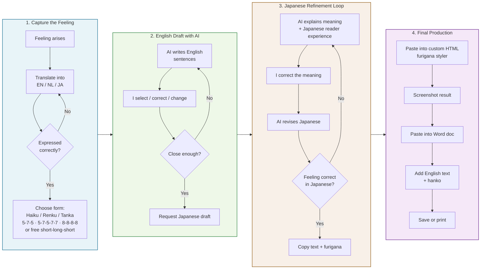
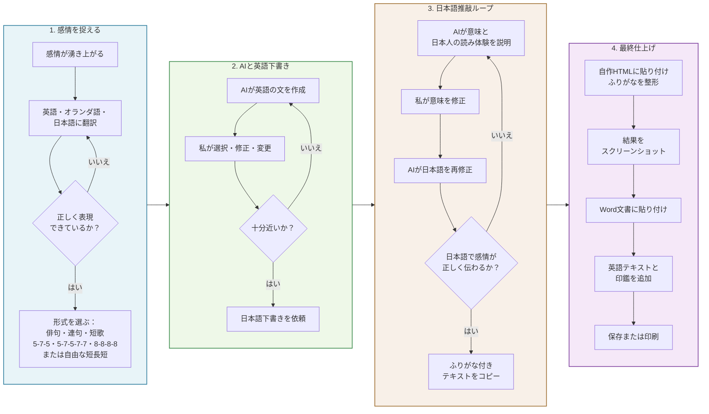

# How I Create a Haiku – Process Flow

A4 landscape friendly diagrams.  
Loops are shown with return arrows inside each phase.

---

## English Version

---

## 日本語版

---

### Notes
- Designed to use page **width** (left → right phases) instead of one long vertical diagram.
- Each phase contains its own decision/loop arrows.
- Compatible with GitHub, Obsidian, Notion, VS Code, mermaid.live, etc.
